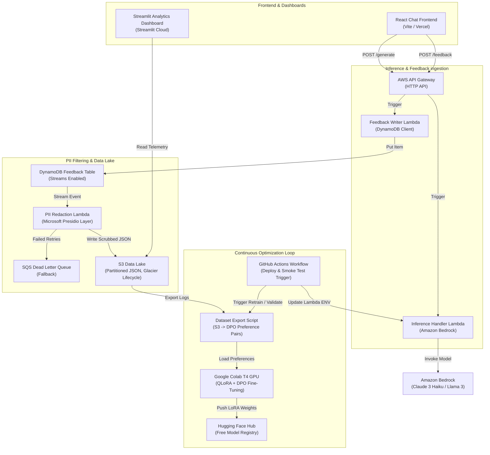

# AI Feedback Learning Platform

An enterprise-grade, cost-optimized **Self-Improving Generative AI System** built with automated feedback loops, PII redaction, model evaluation, and continuous learning on AWS.

This portfolio project demonstrates a production-ready **Reinforcement Learning from Human Feedback (RLHF / DPO)** pipeline designed to cost **$0** (within AWS Free Tier) to run for low-to-medium volume, bypassing expensive SageMaker endpoints in favor of serverless compute and open-source models.

---

## 🏗️ Architecture Overview

The platform uses a fully decoupled, event-driven serverless architecture.



### Key Architectural Cost Decisions:
1. **Amazon Bedrock (Pay-per-Token) vs. Dedicated SageMaker Endpoints:** SageMaker endpoints charge 24/7 for hosting an EC2 node, costing upwards of $50+/month even when idle. Bedrock operates completely serverless, costing fractions of a cent per prompt.
2. **Microsoft Presidio vs. AWS Comprehend:** AWS Comprehend charges per 100 characters scanned for PII, which quickly compounds. Presidio is open-source and runs inside a Lambda layer entirely for free.
3. **Google Colab Free GPU vs. SageMaker Training:** Model training is delegated to a free Google Colab T4 GPU instance, keeping the training cost at $0.
4. **Streamlit Community Cloud vs. AWS QuickSight:** Dashboards are deployed on Streamlit's free hosting tier, preventing QuickSight license costs.

---

## 📂 Project Structure

```
├── .github/workflows/
│   └── retrain.yml                 # GitHub Actions weekly dataset export & deployment triggers
├── dashboard/
│   ├── app.py                      # Multi-page Streamlit analytics dashboard (Exec, Tech, Business)
│   └── requirements.txt            # Streamlit dashboard python packages
├── frontend/
│   ├── src/
│   │   ├── api.js                  # Client calls to AWS API Gateway / Local Simulation
│   │   ├── telemetry.js            # Capture implicit engagement metrics (scrolling, hovers, read speed)
│   │   ├── index.css               # Modern neon dark-mode styles & glassmorphic cards
│   │   ├── App.jsx                 # Vite React core chat component
│   │   └── main.jsx                # Web entrypoint
│   ├── package.json                # npm configuration (Vite, React, Lucide Icons)
│   └── index.html                  # HTML structure and SEO head meta tags
├── infrastructure/
│   ├── main.tf                     # Provider and global configuration
│   ├── variables.tf                # AWS configuration inputs
│   ├── lambda.tf                   # Inference Lambda + IAM Roles + Bedrock attachment
│   ├── api_gateway.tf              # HTTP API Gateway configurations & CORS configurations
│   ├── storage.tf                  # DynamoDB Table (Streams enabled) + S3 Data Lake
│   ├── feedback_lambda.tf          # Feedback Collector Lambda configs
│   ├── pii_lambda.tf               # PII scrubbing worker (DynamoDB trigger + SQS DLQ)
│   └── monitoring.tf               # CloudWatch Alarms & $2 AWS Monthly Budget constraint
└── src/
    ├── inference/
    │   └── app.py                  # Inference lambda handler (Bedrock Invoke API)
    ├── feedback_writer/
    │   └── app.py                  # Lambda handler writing explicit/implicit signals to DynamoDB
    ├── pii_redaction/
    │   ├── app.py                  # Presidio Lambda worker scrubbing text to S3
    │   └── requirements.txt        # Presidio modules
    └── mlops/
        ├── prepare_dataset.py      # DPO Preference extraction script (S3 JSON -> chosen/rejected pairs)
        ├── deploy_model.py         # Script to update active inference model via Lambda env vars
        └── AI_Feedback_Platform_DPO_Finetuning.ipynb  # Google Colab notebook for LoRA DPO tuning
```

---

## 🚀 Setup & Deployment

### 1. Pre-requisites
- AWS CLI configured with administrator credentials.
- Node.js & npm (v18+) for the frontend.
- Python 3.11 for the backend lambda packager and local running.
- Terraform installed (optional - for AWS automated deployment).

### 2. Deploy AWS Infrastructure (Terraform)
Navigate to the `infrastructure/` directory and deploy:
```bash
cd infrastructure
terraform init
terraform apply
```
*Note the output variable `api_url` once completed. This is your API Gateway endpoint.*

### 3. Run the React Chat Client
1. Enter the `frontend/` directory and configure the API endpoint:
   ```bash
   cd ../frontend
   npm install
   ```
2. Start the Vite development server:
   ```bash
   npm run dev
   ```
3. Open `http://localhost:5173` in your browser.
4. Click the **Gear Icon** in the top right and paste your Terraform `api_url`. (If left blank, the app runs in **Demo Sandbox Mode** with high-fidelity local LLM simulations).

### 4. Run the Streamlit Analytics Dashboard
1. Go to the `dashboard/` directory and install Python dependencies:
   ```bash
   cd ../dashboard
   pip install -r requirements.txt
   ```
2. Run the dashboard application locally:
   ```bash
   streamlit run app.py
   ```
   *If your AWS environment variables are active, Streamlit connects to your live S3 Data Lake. Otherwise, it loads a beautiful dummy dataset for portfolio presentation.*

### 5. Execute MLOps Continuous Learning
1. Use the data export script to create preference JSONL pairs from your data lake:
   ```bash
   python ../src/mlops/prepare_dataset.py --bucket <your-s3-bucket-name> --output dataset.jsonl
   ```
2. Upload the `dataset.jsonl` to Hugging Face or open the Colab notebook: `src/mlops/AI_Feedback_Platform_DPO_Finetuning.ipynb`.
3. Run the training cells. The notebook will load `TinyLlama-1.1B`, apply PEFT/LoRA adapters, fine-tune them on your preference pairs using the `DPOTrainer`, and push the adapter to the Hugging Face Hub.
4. Run `deploy_model.py` or trigger the GitHub Action to point your Lambda function's `MODEL_ID` environment variable to the new model, completing the self-improving loop.

---

## 📈 System Monitoring & Safety Limits

To ensure this application continues running safely on your personal AWS account without costing money:
- **CloudWatch Alarms:** Monitored error levels and DLQ messages warn you if lambda instances fail or Presidio fails to anonymize PII.
- **AWS Budgets Alert:** An alert is created to trigger at **$2.00/month** actual or forecasted spending, sending an email directly to your configured alert address.
- **Glacier Lifecycle:** S3 logs are transitioned to deep-archive storage classes automatically after 90 days.
